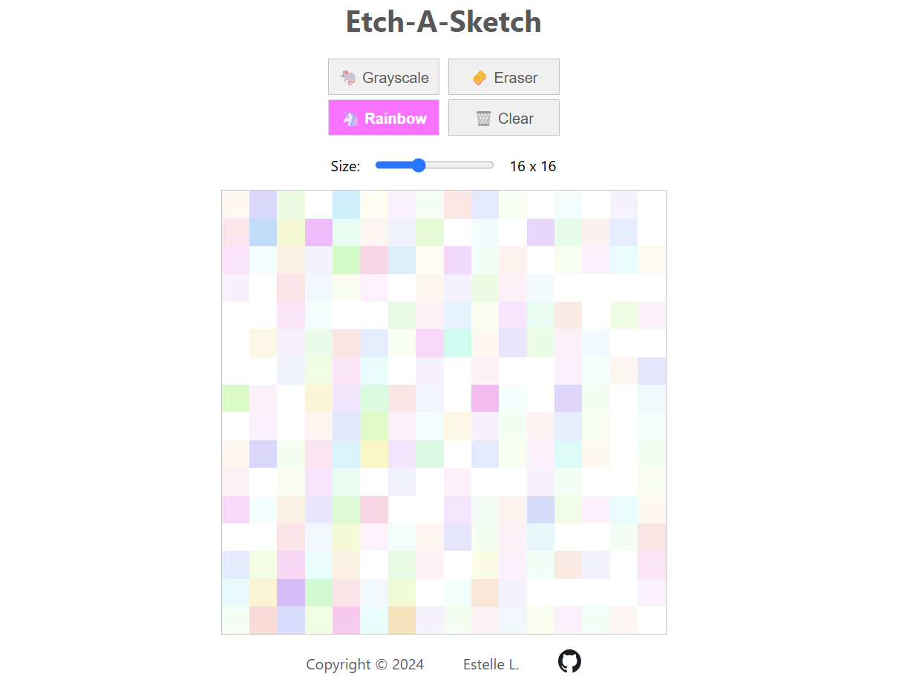

# Etch-a-Sketch

A digital Etch-a-Sketch app built with HTML, CSS, and JavaScript.
This project is part of **The Odin Project** curriculum and serves as a practice for DOM manipulation and responsive layout skills.

🔗 Live demo: https://estellel-github.github.io/etch-a-sketch/

## Overview

### Features

- Configurable grid size, allowing users to specify up to a 42x42 grid for finer sketches.
- Pen effect: start drawing when clicking, keep drawing if moved, stop drawing when released. Works on mobile as well with touch events.
- Progressive darkening of each square with each hover.
- Option to use randomized colors, to erase individual squares, and to clear the grid.

### Tools Used

- **Development:** Visual Studio Code
- **Version Control:** Git and GitHub
- **Layout and Styling:** CSS Flexbox to create the grid layout and ensure responsive behavior on different devices
- Learning materials from Odin Project curriculum (Foundations) and support from their Discord community

### External Resources

- For the functions creating random colors in `colors.js`, I used this post as a resource: https://martin.ankerl.com/2009/12/09/how-to-create-random-colors-programmatically/. At first tried the naive approach described in this article but indeed the result was not particularly pleasing to the eye. Then I adapted his golden ratio algorithm for my JS functions which gave the desired effect.

## Learning Outcomes

- Gained experience in **flexbox layout**, ensuring that the grid remains square and centered within a responsive container.
- Improved **DOM manipulation** skills by dynamically creating and adjusting the grid layout.
- Practiced **event handling** to add interactive effects, like hover color changes and grid resets.
- Learned **CSS opacity** and how to incrementally darken elements.
- Learned **click events and touch events** in order to obtain the desired drawing behavior, both on desktop and mobile.
- Learned usefulness of **RGB to randomize colors** when having specific constraints (not too dark, not too bright, very distinct colors, number of colors not known initially).

## How to Use

1. Clone the repository and open `index.html` in a browser.
2. Click or touch then hover over the grid to draw. Release to stop drawing.
3. Use the various buttons to change the drawing mode (grey/color/eraser) or to clear the grid.
